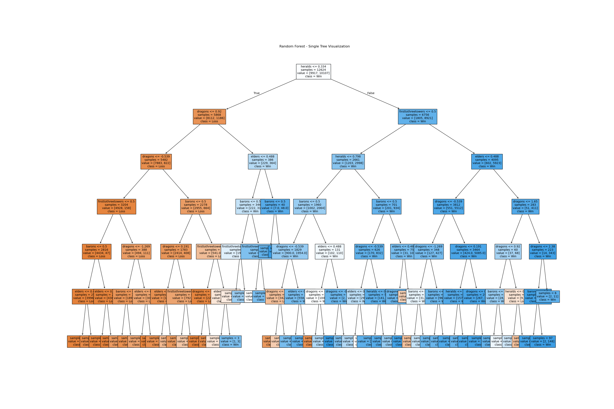

    <h1>League of Legends Analytics on Professional Teams</h1>
    
Objective Control and Win Rate Insights

    <h3>League of Legends: Objectives and Their Importance for League Win-Rates</h3>

    League of Legends is a MOBA (Multiplayer Online Battle Arena) style game where teams of five fight each other in order to defeat the nexus (main objective) and win.

    <h3>Key Match Insights</h3>

<ul>
    <li>In League of Legends, <strong>Dragon control</strong> is often considered a critical objective that can significantly impact a team's chances of winning.</li>
    <li>Teams that secure more dragons have better late-game scaling, buffs, and map control, leading to a higher probability of success.</li>
    <li>Once four dragons have been secured by a team, that is the maximum number a team can have. However, if there is a stalemate of dragon control, one team could acquire 3 versus the opposite team having 4.</li>
</ul>

    <h3>Analysis Question</h3>

    Does obtaining more dragons correlate with a higher win rate in (<strong>tier-one league</strong>) League of Legends matches?

    Dragon control is a key part of professional play, offering buffs that scale throughout the game. Investigating whether controlling more dragons aligns 
    with a higher win rate could reveal insights about team strategies, objective prioritization, and meta preferences.
    This analysis could help coaches make better choices as to whether dragons are an important factor in winning the game.

    <h3>Dataset Summary</h3>

    The dataset contains approximately <strong>150,000 rows</strong> of data. For this analysis, we will focus on the following columns:

<table>
    <thead>
        <tr>
            <th><strong>Column</strong></th>
            <th><strong>Definition</strong></th>
        </tr>
    </thead>
    <tbody>
        <tr>
            <td><strong>dragons</strong></td>
            <td>The number of dragons secured.</td>
        </tr>
        <tr>
            <td><strong>league</strong></td>
            <td>The tier-one league where the match took place (e.g., LCS, LEC, LCK, LPL).</td>
        </tr>
        <tr>
            <td><strong>result</strong></td>
            <td>The outcome of the match, indicating whether the team won (1) or lost (0).</td>
        </tr>
    </tbody>
</table>

    These columns are central to answering our question about the relationship between dragon control and win rates in professional matches.

    <h1>Data Cleaning and Exploratory Data Analysis</h1>

    In the data cleaning process, several steps were performed to prepare this dataset for analysis:

<ul>
    <li>Loaded the dataset from the 2022 League of Legends Esports match data using Oracle’s Elixir.</li>
    <li>Filtered the dataset to retain only rows corresponding to team-level data by selecting rows where the <code>position</code> column equals "team".</li>
    <li>Converted the game length from seconds to minutes and stored the result in a new column, <code>gamelength_minutes</code>, rounded to two decimal places for better readability.</li>
    <li>Transformed the <code>result</code> column into a boolean format and stored it in a new column, <code>result_bool</code>, to facilitate binary classification analysis.</li>
</ul>

    The first few rows and columns are shown below:

<table>
    <thead>
        <tr>
            <th><strong>gameid</strong></th>
            <th><strong>datacompleteness</strong></th>
            <th><strong>url</strong></th>
            <th><strong>league</strong></th>
            <th><strong>year</strong></th>
            <th><strong>split</strong></th>
            <th><strong>playoffs</strong></th>
            <th><strong>date</strong></th>
            <th><strong>game</strong></th>
            <th><strong>patch</strong></th>
            <th><strong>xpdiffat25</strong></th>
            <th><strong>csdiffat25</strong></th>
            <th><strong>killsat25</strong></th>
        </tr>
    </thead>
    <tbody>
        <tr>
            <td>ESPORTSTMNT01_2690210</td>
            <td>complete</td>
            <td>NaN</td>
            <td>LCKC</td>
            <td>2022</td>
            <td>Spring</td>
            <td>0</td>
            <td>2022-01-10 07:44:08</td>
            <td>1</td>
            <td>12.01</td>
            <td>-3971.0</td>
            <td>-97.0</td>
            <td>6.0</td>
        </tr>
        <tr>
            <td>ESPORTSTMNT01_2690210</td>
            <td>complete</td>
            <td>NaN</td>
            <td>LCKC</td>
            <td>2022</td>
            <td>Spring</td>
            <td>0</td>
            <td>2022-01-10 07:44:08</td>
            <td>1</td>
            <td>12.01</td>
            <td>3971.0</td>
            <td>97.0</td>
            <td>7.0</td>
        </tr>
        <tr>
            <td>ESPORTSTMNT01_2690219</td>
            <td>complete</td>
            <td>NaN</td>
            <td>LCKC</td>
            <td>2022</td>
            <td>Spring</td>
            <td>0</td>
            <td>2022-01-10 08:38:24</td>
            <td>1</td>
            <td>12.01</td>
            <td>-7746.0</td>
            <td>-33.0</td>
            <td>1.0</td>
        </tr>
        <tr>
            <td>ESPORTSTMNT01_2690219</td>
            <td>complete</td>
            <td>NaN</td>
            <td>LCKC</td>
            <td>2022</td>
            <td>Spring</td>
            <td>0</td>
            <td>2022-01-10 08:38:24</td>
            <td>1</td>
            <td>12.01</td>
            <td>7746.0</td>
            <td>33.0</td>
            <td>8.0</td>
        </tr>
        <tr>
            <td>8401-8401_game_1</td>
            <td>partial</td>
            <td><a href="https://lpl.qq.com/es/stats.shtml?bmid=8401">Link</a></td>
            <td>LPL</td>
            <td>2022</td>
            <td>Spring</td>
            <td>0</td>
            <td>2022-01-10 09:24:26</td>
            <td>1</td>
            <td>12.01</td>
            <td>NaN</td>
            <td>NaN</td>
            <td>NaN</td>
        </tr>
    </tbody>
</table>

    <h3>Univariate Analysis</h3>
    
The following plot shows the distribution of dragons secured in professional League of Legends matches:

<iframe 
    src="assets/dragons_plot.html" 
    width="800" 
    height="600" 
    frameborder="0" 
    style="border: none; margin-bottom: 20px;">
</iframe>

    Looking at the data, it seems most professional teams acquire between 2-4 dragons every game. 
    These higher numbers indicate dragon stalemates, as having any more than 4 dragons in a game would 
    mean both teams are having even fights to obtain dragons.

<iframe 
    src="assets/avg_dragons.html" 
    width="800" 
    height="600" 
    frameborder="0" 
    style="border: none; margin-top: 20px; margin-bottom: 20px;">
</iframe>

    Most leagues averaged about 2.2 dragons this season (2022). However, the highest average is in the 
    LCK, which could be telling of their strategy for prioritizing dragons compared to other teams.

    <h3>Bivariate Analysis</h3>
    
The following plots show the relationships between two columns in the data:

<iframe 
    src="assets/vspm_v_kills.html" 
    width="800" 
    height="600" 
    frameborder="0" 
    style="border: none; margin-top: 20px; margin-bottom: 20px;">
</iframe>

    Teams with a higher VSPM tend to be more active in creating map pressure and securing kills. This correlation 
    is seen in the plot showing the importance of vision control in facilitating aggressive plays and securing objectives.

    <h3>Interesting Aggregates</h3>
    
The following plot show the relationship between win rate and the number of dragons secured after aggregating the data:

<iframe 
    src="assets/agg_wr.html" 
    width="800" 
    height="600" 
    frameborder="0" 
    style="border: none; margin-top: 20px; margin-bottom: 20px;">
</iframe>

    After <code>groupby</code>-ing the win rate by the number of dragons secured, the analysis reveals a clear positive correlation. 
    This means that as teams secure more dragons during a match, their likelihood of winning increases significantly. 
    The positive correlation shows the importance of dragon control as a strategic objective in professional play, 
    as it provides advantages that translate into higher success rates in matches.

    <h1>Assessment of Missingness</h1>

    <h3>NMAR Analysis</h3>

    Based on the dataset, I believe that the <code>result</code> column (indicating whether the team won or lost) is 
    Not Missing at Random (NMAR). This means the missingness of the <code>result</code> column is directly related 
    to the outcome of the matches themselves, and the probability of a missing value is influenced by factors tied 
    to the column's content. For example, <code>result</code> could be missing more often in matches that were 
    forfeited, abandoned, or had technical issues. For instance, if a match ends prematurely, its result may not 
    be recorded. Technical issues have occurred in professional matches before, further contributing to missing 
    data in this column.

    <h3>Missingness Dependency</h3>
    

        The analysis aimed to determine if <code>gamelength</code> is Missing at Random (MAR) on the <code>barons</code> column, 
        based on a permutation test using the Kolmogorov-Smirnov (KS) statistic.
    

    <ul>
        <li><strong>Observed KS Statistic</strong>: 0.0412</li>
        <li><strong>Permutation P-value</strong>: 0.0</li>
    </ul>
    <iframe
      src="assets/ks_dist.html"
      width="800"
      height="600"
      frameborder="0"
    ></iframe>
    <h4>Interpretation of Results</h4>
    <ul>
        <li><strong>Observed KS Statistic</strong>: 
            The KS statistic measures the difference between the distributions of <code>gamelength</code> for rows 
            where <code>barons</code> is missing versus not missing. A higher value indicates more significant differences 
            between the two distributions.
        </li>
        <li><strong>Permutation P-value</strong>: 
            The p-value quantifies the likelihood of observing a KS statistic at least as extreme as 0.0412 under the null 
            hypothesis that the missingness of <code>barons</code> is independent of <code>gamelength</code>. A p-value of 0.0 
            indicates that this result is extremely unlikely under the null hypothesis.
        </li>
    </ul>
    <h4>Conclusion</h4>
    

        The <strong>p-value of 0.0</strong> suggests strong evidence to reject the null hypothesis. This implies that the missingness 
        of <code>barons</code> is not independent of <code>gamelength</code>. Therefore, <code>gamelength</code> is likely 
        <strong>MAR on `barons`</strong>, as the distribution of game length depends on whether the <code>barons</code> data is missing 
        or not.
    

    

        The analysis aimed to determine if <code>result</code> is Missing at Random (MAR) on the <code>gamelength</code> column, 
        based on a permutation test using the Total Variation Distance (TVD) statistic.
    

    <ul>
        <li><strong>Observed TVD</strong>: 0.000548</li>
        <li><strong>Permutation P-value</strong>: 1.0</li>
    </ul>
    <iframe
      src="assets/tvd_dist.html"
      width="800"
      height="600"
      frameborder="0"
    ></iframe>
    <h4>Interpretation of Results</h4>
    <ul>
        <li><strong>Observed TVD</strong>: 
            The TVD measures the total variation between the distributions of <code>result</code> for rows where 
            <code>gamelength</code> is missing versus not missing. A higher value indicates more significant differences 
            between the two distributions.
        </li>
        <li><strong>Permutation P-value</strong>: 
            The p-value quantifies the likelihood of observing a TVD at least as extreme as 0.000548 under the null 
            hypothesis that the missingness of <code>gamelength</code> is independent of <code>result</code>. A p-value of 
            1.0 indicates that this result is very likely under the null hypothesis.
        </li>
    </ul>
    <h4>Conclusion</h4>
    

        The <strong>p-value of 1.0</strong> suggests no evidence to reject the null hypothesis. This implies that the missingness 
        of <code>gamelength</code> is independent of <code>result</code>. Therefore, <code>result</code> is not <strong>MAR on 
        `gamelength`</strong>, as there is no significant dependency between the two variables.
    
    

    <h1>Hypothesis Testing</h1>
        

        <h2>Hypothesis Test: Relationship Between Dragon Control and Win Rate</h2>
    
        <h3>Hypotheses</h3>
        

            We are testing whether the Tier-one league with the highest average dragon control also has a significantly higher win rate compared to the average win rate across all Tier-one leagues.
        

        <ul>
            <li><strong>Null Hypothesis (H0)</strong>: The league with the highest average dragon control does not have a higher win rate than the average win rate across the tier one league. Any observed difference is due to random chance.</li>
            <li><strong>Alternative Hypothesis (H1)</strong>: The league with the highest average dragon control has a significantly higher win rate than the average win rate across the tier one league.</li>
            <li><strong>Significance Level</strong>: 0.05</li>
        </ul>
    
        <h3>Observed Statistic</h3>
        <ul>
            <li>First, we identified the league with the highest average dragon control.</li>
            <li><strong>Observed Statistic</strong>: Win Rate of the League with Highest Dragon Control – Mean Win Rate Across All Leagues</li>
            <li>In this case, the observed statistic is <strong>0.0784</strong>.</li>
        </ul>
    
        <h3>Permutation Test</h3>
        
To test the null hypothesis, we conducted a permutation test:

        <ol>
            <li>Randomly shuffled the win rates across leagues.</li>
            <li>Calculated the test statistic (difference in win rates) for each permutation.</li>
            <li>Repeated the permutation process 10,000 times to build the null distribution of the test statistic.</li>
        </ol>
        <h3>Results</h3>
        
The p_value acquired from the permutation test was : 0.0373. Since this is <= 0.05 we can reject the null hypothesis. This would mean it is plausible that the league with
        the highest average dragon control has significantly higher win rate compared to the tier one league. This could mean that teams who prioritize <code>dragons</code> compared to other objectives have a higher chance of winning matches, which would influence how coaches of the game would excecute their strategies.

    

    <h1>Baseline Model</h1>
        

        <h2>Prediction Problem: Predicting Team Victory Using Game Objectives</h2>
    
        <h3>Prediction Problem</h3>
        

            The goal is to predict whether a team wins or loses a game based on the number of key objectives they secured during the game. Specifically, the features used for prediction are:
        

        <ul>
            <li><strong>Barons</strong>: The number of Baron Nashor objectives secured. (<code>quantitative</code>)</li>
            <li><strong>Dragons</strong>: The number of dragons secured. (<code>quantitative</code>)</li>
            <li><strong>Heralds</strong>: The number of Rift Heralds secured. (<code>quantitative</code>)</li>
            <li><strong>Elders</strong>: The number of Elder Dragons secured. (<code>quantitative</code>)</li>
            <li><strong>Firsttothreetowers</strong>: Boolean of the team to secure the first three towers. (<code>nominal</code>)</li>
        </ul>
        

            The target variable is:
        

        <ul>
            <li><strong>Result</strong>: A binary variable indicating whether the team won (1) or lost (0) the game. (<code>nominal</code>)</li>
        </ul>
        <h3>Encoding</h3>
        

            The following encodings were performed on the data to prepare it for analysis:
            <ul>
                <li>
                    <strong>Barons:</strong> This column was binarized to a threshold of 1.0. Matches with more than 1 baron are rare, so the column was encoded to indicate whether a team secured at least 1 baron (1) or none (0).
                </li>
                <li>
                    <strong>Dragons:</strong> This column was retained as a numerical feature since dragon counts are more distributed (e.g., 0-7) and provide useful variability for predictive modeling without binarization.
                </li>
                <li>
                    <strong>Elders:</strong> Similar to barons, matches with more than 1 elder dragon are rare. This column was binarized to indicate whether a team secured at least 1 elder dragon (1) or none (0).
                </li>
                <li>
                    <strong>Heralds:</strong> Matches with more than 2 heralds are rare, so the column was binarized to a threshold of 1.0, indicating whether a team secured at least 1 herald (1) or none (0).
                </li>
                <li>
                    <strong>FirstToThreeTowers:</strong> This column was already binary, so it was retained as-is. It indicates whether a team was the first to secure three towers in a match.
                </li>
            </ul>
            These encodings ensure the data is more interpretable and suitable for machine learning models, reducing unnecessary complexity while retaining meaningful distinctions in key objectives.
        

        <h3>Approach</h3>
        

            We will use a <strong>Decision Tree Classifier</strong> to predict the outcome of a match (win or loss) based on the number of objectives secured by a team. The Decision Tree will split the data into branches based on feature thresholds, allowing us to understand how each objective contributes to the prediction. The model will be trained on the dataset and evaluated for its accuracy and interpretability.
        

    
        <h3>Why This Prediction Problem?</h3>
        

            Objectives like Barons, Dragons, Heralds, and Elders, and Towers are often indicators of game strategy and control. Predicting a team’s win based on these objectives could provide valuable insights for players, analysts, and coaches. By understanding the relationship between these objectives and victory, teams can refine their gameplay strategies to optimize their chances of winning.
        

    

    <h3>Results</h3>
        

            The performance of the current model is as follows:
            <ul>
                <li><strong>Test Accuracy:</strong> 0.8188</li>
                <li><strong>Train Accuracy:</strong> 0.8146</li>
            </ul>
            While the model achieves over 80% accuracy on both the training and testing datasets, indicating it generalizes reasonably well to unseen data, this performance is considered "okay" rather than exceptional. There are likely areas for improvement, as the model does not fully capture the complexity of the relationships in the data. Factors such as the choice of features, the type of model, and the handling of missing data could be contributing to its limitations.
        

        

            To enhance the model's performance, the following steps could be considered:
            <ul>
                <li>Feature engineering to better capture key interactions or important aspects of the game.</li>
                <li>Testing more complex models, such as ensemble methods (e.g., random forests or gradient boosting).</li>
                <li>Hyperparameter tuning to optimize the performance of the decision tree.</li>
            </ul>
            Overall, while the model's performance is a good starting point, there is significant room for improvement to better capture the nuances of professional League of Legends matches.
        
    

    <h1>Final Model</h1>
    <h3>Features Added</h3>
    

        The following features were added to the model, and their transformations were specifically chosen to address unique aspects of the data and improve predictive performance:
    

    <ul>
        <li>
            <strong>Dragons:</strong> This feature was kept as a numerical column because the range of values (0–7) is relatively large compared to other features. A 
            <code>Standard Scaler</code> was applied to normalize the range and ensure fair contribution across features. This feature is critical because dragons provide significant in-game advantages that likely correlate with match outcomes.
        </li>
        <li>
            <strong>Barons:</strong> The distribution of this feature was heavily skewed, with the majority of matches featuring 0 or 1 Baron. A 
            <code>Quantile Transformer</code> was applied to mitigate the skew and create a more uniform distribution.
        </li>
        <li>
            <strong>Elders:</strong> Similar to Barons, this feature exhibited a skewed distribution (most games had 0 or 1 Elder Dragon). A 
            <code>Quantile Transformer</code> was used to address the skew and make the feature more informative for the model.
        </li>
    </ul>
    <h3>Why These Features Improve Performance</h3>
    

        These features were selected and transformed to align with the underlying data-generating process of professional League of Legends matches:
    

    <ul>
        <li>
            The addition of <strong>Dragons</strong> captures critical information about a team's control over map objectives and scaling potential, which is closely tied to match success.
        </li>
        <li>
            <strong>Barons</strong> and <strong>Elders</strong> are both high-impact objectives that heavily influence late-game outcomes. By addressing their skewed distributions, the model can better differentiate matches with these objectives and incorporate this information into predictions.
        </li>
        <li>
            Scaling and transformation choices (e.g., <code>Standard Scaler</code> and <code>Quantile Transformer</code>) ensure that each feature contributes appropriately to the model, avoiding dominance by features with larger numerical ranges or skewed distributions.
        </li>
    </ul>
    <h3>Final Model Performance</h3>
    

        The final model is a <strong>Random Forest Classifier</strong> tuned using <code>GridSearchCV</code>. The best hyperparameters found were:
    

    <ul>
        <li><strong>Max Depth:</strong> 6</li>
        <li><strong>Max Features:</strong> Log2</li>
        <li><strong>Min Samples Leaf:</strong> 2</li>
        <li><strong>Min Samples Split:</strong> 8</li>
        <li><strong>Number of Estimators:</strong> 50</li>
    </ul>
    

        The model achieved a <strong>Test Set Accuracy</strong> of 0.872, demonstrating its ability to make accurate predictions. While the model performs decently, further feature engineering or the inclusion of more advanced models might improve its performance.
    

    

